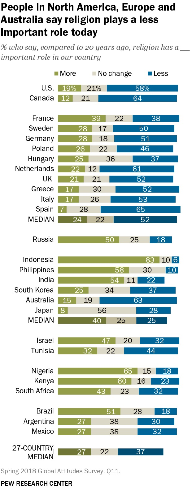
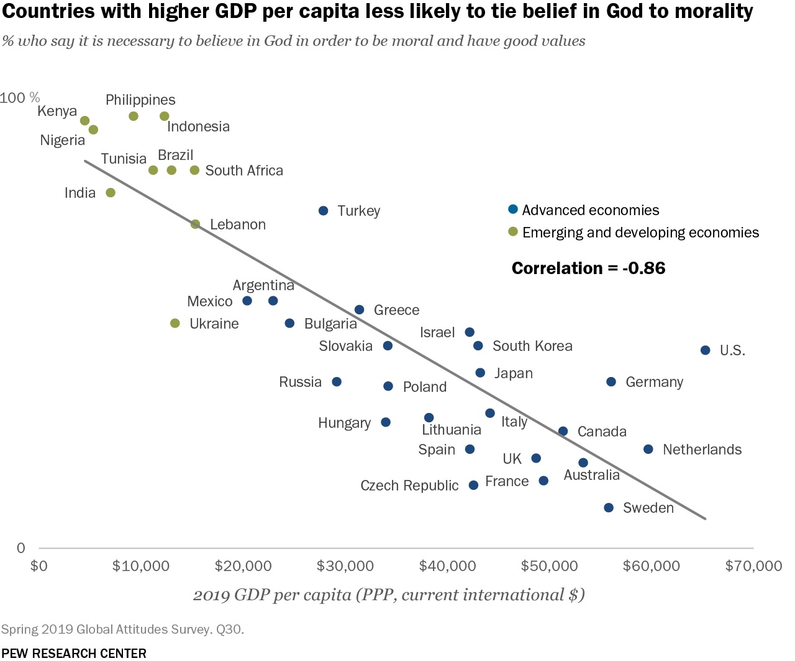
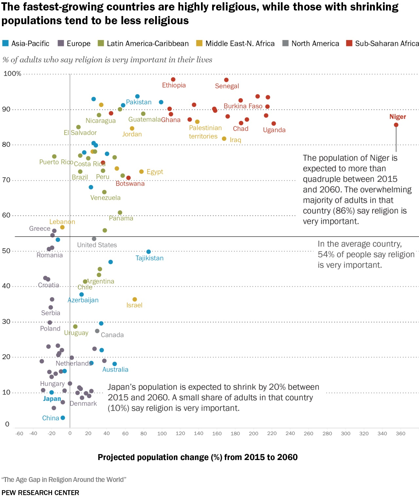
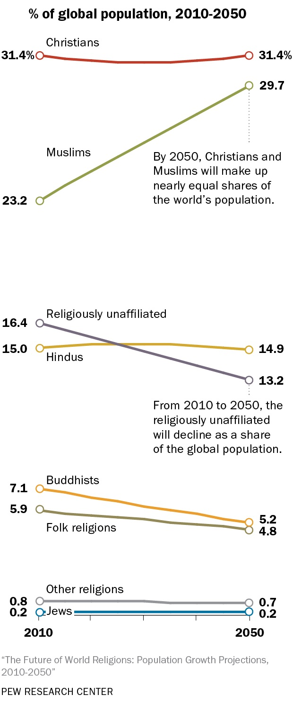
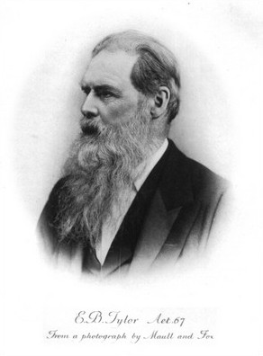
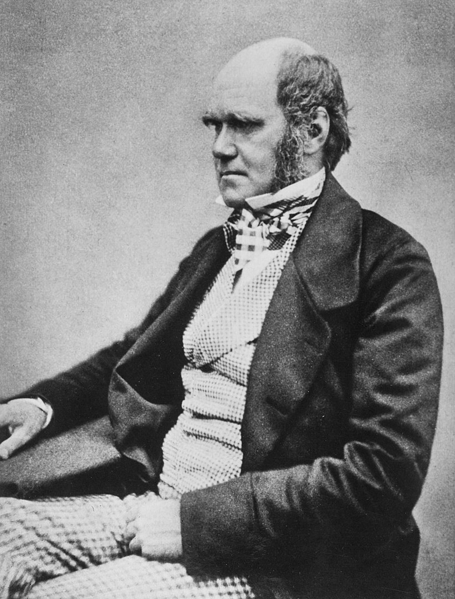

# Geschichte, Theorien und Methoden der Religionswissenschaft

### Wie Religion zum Forschungsgegenstand wurde
{: .r-fit-text}
  
#### 2. Ursprünge: Edward Tylor
#### Wie entwickelt sich Kultur?

Wintersemester 2024/2025
Prof. Dr. Nathan Gibson

## 📈 Rückblick

Entdeckungen und Erfindungen in ...
- Evolution
- Archäologie
- Philologie & Sprachwissenschaft
- Psychologie
- Technologie

## Heutiges Lernziel

Erklären können, welcher Zusammenhang zwischen Edward Tylors Theorie des Animismus und den Debatten und dem Wissensstand seiner Zeit besteht.

## Die Zukunft der Religion

Peter Berger, *The Desecularization of the World* (1999)

## Die Zukunft der Religion

- Pew Research Center. 2022. “Key Findings From the Global Religious Futures Project.” Pew Research Center’s Religion & Public Life Project. <https://www.pewresearch.org/religion/2022/12/21/key-findings-from-the-global-religious-futures-project/>.

## Die Zukunft der Religion

{: .r-stretch}

<figcaption>Pew Research Center. 2022. “Key Findings From the Global Religious Futures Project.” Pew Research Center’s Religion & Public Life Project. https://www.pewresearch.org/religion/2022/12/21/key-findings-from-the-global-religious-futures-project/.
</figcaption>

## Die Zukunft der Religion

{: .r-stretch}

<figcaption>Pew Research Center. 2022. “Key Findings From the Global Religious Futures Project.” Pew Research Center’s Religion & Public Life Project. https://www.pewresearch.org/religion/2022/12/21/key-findings-from-the-global-religious-futures-project/.
</figcaption>

## Die Zukunft der Religion

{: .r-stretch}

<figcaption>Pew Research Center. 2022. “Key Findings From the Global Religious Futures Project.” Pew Research Center’s Religion & Public Life Project. https://www.pewresearch.org/religion/2022/12/21/key-findings-from-the-global-religious-futures-project/.
</figcaption>

## Die Zukunft der Religion

{: .r-stretch}

<figcaption>Pew Research Center. 2022. “Key Findings From the Global Religious Futures Project.” Pew Research Center’s Religion & Public Life Project. https://www.pewresearch.org/religion/2022/12/21/key-findings-from-the-global-religious-futures-project/.
</figcaption>

## Eine grundlegende Frage

Woher kommt die Religion? Wo geht sie hin? 

## Sir Edward Burnet Tylor

{: .r-stretch}
<figcaption>CC BY-SA 3.0, https://commons.wikimedia.org/w/index.php?curid=632860</figcaption>

- geb. 1832, in London
- Quaker-Familie, kein Universitätsabschluss
- 1856 Reise nach Mexiko

## Sir Edward Burnet Tylor

- 1865 _Researches into the early history of Mankind_
- 1871 _Primitive culture: Researches into the development of mythology, philosophy, religion, art, and custom_
- 1912 knighted ("Sir")
- gest. 1917

## Charles Darwin (1809-1882)

{: .r-stretch}
<figcaption>By Charles_Darwin_seated.jpg: Henry Maull (1829–1914) and John Fox (1832–1907) (Maull & Fox) [3]derivative work: Beao - Charles_Darwin_seated.jpg, Public Domain, https://commons.wikimedia.org/w/index.php?curid=11264065</figcaption>

- 1831-1836 _Beagle_ Reise
- 1839 Journal
- 1859 _On the Origin of Species_
- 1871 _Descent of Man_

## Charles Darwin (1809-1882)

{: .r-stretch}
<figcaption>By © Sémhur / Wikimedia Commons, CC BY-SA 4.0, https://commons.wikimedia.org/w/index.php?curid=3003026</figcaption>

- 1831-1836 _Beagle_ Reise
- 1839 Journal
- 1859 _On the Origin of Species_
- 1871 _Descent of Man_

## Darwin on Religion

> Belief in God—Religion.—There is no evidence that man was aboriginally endowed with the ennobling belief in the existence of an Omnipotent God. On the contrary there is ample evidence, derived not from hasty travellers, but from men who have long resided with savages, that numerous races have existed and still exist, who have no idea of one or more gods, and who have no words in their languages to express such an idea. The question is of course wholly distinct from that higher one, whether there exists a Creator and Ruler of the universe; and this has been answered in the affirmative by the highest intellects that have ever lived.

## Darwin on Religion

> If, however, we include under the term "religion" the belief in unseen or spiritual agencies, the case is wholly different; for this belief seems to be almost universal with the less civilised races. Nor is it difficult to comprehend how it arose. As soon as the important faculties of the imagination, wonder, and curiosity, together with some power of reasoning, had become partially developed, man would naturally have craved to understand what was passing around him, and have vaguely speculated on his own existence. ... 

## Darwin on Religion

> It is probable, as Mr. Tylor has clearly shewn, that dreams may have first given rise to the notion of spirits; for savages do not readily distinguish between subjective and objective impressions. When a savage dreams, the figures which appear before him are believed to have come from a distance and to stand over him; or "the soul of the dreamer goes out on its travels, and comes home with a remembrance of what it has seen." But until the above-named faculties of imagination, curiosity, reason, &c., had been fairly well developed in the mind of man, his dreams would not have led him to believe in spirits, any more than in the case of a dog. (1871, 1:65)

## Tylor & Evolution

Assumptions?

## Tylor & Animismus

Argument?

## Tylor & "Survivals"

Functions?

## Vorschau

James Frazer