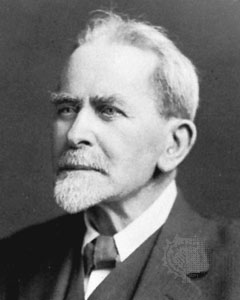

# Geschichte, Theorien und Methoden der Religionswissenschaft

### Wie Religion zum Forschungsgegenstand wurde
{: .r-fit-text}
  
#### 3. Ursprünge: James Frazer
#### Was hat Magie mit Religion zu tun?

Wintersemester 2024/2025
Prof. Dr. Nathan Gibson

## 📈 Rückblick: Letztes Lernziel

Erklären können, welcher Zusammenhang zwischen Edward Tylors Theorie des Animismus und den Debatten und dem Wissensstand seiner Zeit besteht.

## 📈 Rückblick: Die Zukunft der Religion

Die Frage "Woher kommt die Religion?" als Indiz für die Frage "Wo geht sie hin?" bei Religionswissenschaftlern u.a. Edward Tylor

## 📈 Rückblick: Sir Edward Burnet Tylor (1832-1917) & Charles Darwin (1809-1882)

- Darwin: 1831-1836 _Beagle_ Reise, 1839 Journal dazu
- Tylor: 1856 Forschung in Mexiko
- Darwin: 1859 _On the Origin of Species_
- Tylor: 1871 _Primitive culture: Researches into the development of mythology, philosophy, religion, art, and custom_
- Darwin: 1871 _Descent of Man_

## 📈 Rückblick: Darwin & Tylor on Religion

> There is ample evidence ... that numerous races have existed and still exist, who have no idea of one or more gods, and who have no words in their languages to express such an idea ... 

## 📈 Rückblick: Darwin & Tylor on Religion

> If, however, we include under the term "religion" the belief in unseen or spiritual agencies, the case is wholly different; for this belief seems to be almost universal with the less civilised races. It is probable, as Mr. Tylor has clearly shewn, that dreams may have first given rise to the notion of spirits; for savages do not readily distinguish between subjective and objective impressions. (Darwin 1871, 1:65)

## 📈 Rückblick: Tylor & Evolution

- Methods? 
  - Not based on Revelation (Bible) but on collecting reports and observations
- Assumptions? 
  - Starting from zero (no "original" religion)
  - "Primitive" cultures can be identified and taken to represent an earlier stage

## 📈 Rückblick: Tylor & Evolution

- Argument?
  - Animism is the first stage of religious evolution.
  - The words/concepts used by various cultures for soul/spirit show they come from experiences of life/death, dreams, visions, etc.
  - Stages of religious evolution from animism to more developed forms can be identified.
  - "Survivals" are evidence of earlier forms.

## 📈 Rückblick: Key Concept

- "Survivals" as customs that have remained by force of habit, although they are no longer useful
- Possible critique: Shouldn't we be asking not only about function but also meaning? Does the survival of a custom perhaps have to do with its meaning to participants, not just its function?

## Heutiges Lernziel

Frazers Versuch, alle Religionen auf eine gemeinsame Wurzel zurückzuführen, als andauernd prägend wahrzunehmen.

## Sir James George Frazer: Leben

- geb. 1854 in Glasgow
- in Helensburgh, Schottland groß geworden
- studierte in Glasgow und Cambridge

## The Golden Bough (Der Goldene Zweig)



<figcaption>Painting by J. M.W. Turner (1834). Digital image by &lt;a href=&quot;//commons.wikimedia.org/wiki/User:Archaeodontosaurus&quot; title=&quot;User:Archaeodontosaurus&quot;&gt;Didier Descouens&lt;/a&gt; - &lt;span class=&quot;int-own-work&quot; lang=&quot;en&quot;&gt;Own work&lt;/span&gt;, Public Domain, <a href="https://commons.wikimedia.org/w/index.php?curid=122639818">Link</a>.</figcaption>

## Frazer: Religionsdefinition

> By religion, then, I understand a propitiation or conciliation of powers superior to man which are believed to direct and control the course of nature and of human life. In this sense it will readily be perceived that religion is opposed in principle both to magic and to science. (1900, 63)

Warum?

## The Golden Bough (Der Goldene Zweig)

Auflagen: 
- 1890 (2 Bände)
- 1900 (3 Bände)
- 1906–1915 (12 Bände)
- 1922 (abridged)
- 1936 ("Aftermath")

## The Golden Bough: A Study in Comparative Religion, 1. Auflage (1890)

> (1890, vii) For some time I have been preparing a general work on primitive superstition and religion. Among the problems which had attracted my attention was the hitherto unexplained rule of the Arician priesthood; and last spring it happened that in the course of my reading I came across some facts which, combined with others I had noted before, suggested an explanation of the rule in question. As the explanation, if correct, promised to throw light on some obscure features of primitive religion, I resolved to develop it fully, and, detaching it from my general work, to issue it as a separate study. This book is the result.

## The Golden Bough: A Study in Magic and Religion, 2. Auflage (1900)

> (1900, xiii) The kind reception accorded by critics and the public to the first edition of The Golden Bough has encouraged me to spare no pains to render the new one more worthy of their approbation. 

## The Golden Bough, 2. Auflage (1900)

> (1900, xvi) But while my views, tentative and provisional as they probably are, thus remain much what they were, there is one subject on which they have undergone a certain amount of change, unless indeed it might be more exact to say that I seem to see clearly now what before was hazy. I mean the relation of magic to religion. When I first wrote this book I failed, perhaps inexcusably, to define even to myself my notion of religion, and hence was disposed to class magic loosely under it as one of its lower forms. I have now sought to remedy this defect by framing as clear a definition of religion as the difficult nature of the subject and my apprehension of it allowed. 

## The Golden Bough, 2. Auflage (1900)

> (1900, xvii) No one can well be more sensible than I am of the immense variety and complexity of the forces which have gone towards the building up of religion; no one can recognise more frankly the futility and inherent absurdity of any attempt to explain the whole vast organism as the product of any one simple factor. 

## The Golden Bough, "Aftermath" (1936)

> (Aftermath 1936, v)  In that work, as in all my other writings, I have sought to base my conclusions by strict induction on a broad and solid foundation of well-authenticated facts. ...  If my writings should survive the writer, they will do so, I believe, less for the sake of the theories which they propound than for the sake of the facts which they record. They will live, if they live at all, as a picture or moving panorama of the vanished life of primitive man all over the world, from the Tropics to the Poles, groping and stumbling through the mists of ignorance and superstition in the eternal search after goodness and truth.

## The Golden Bough, "Aftermath" (1936)

> (Aftermath 1936, vi) I was beguiled, as by some subtle enchanter, into inditing what I cannot but regard as a dark, a tragic chronicle of human error and folly, of fruitless endeavour, wasted time, and blighted hopes. At the best the chronicle may serve as a warning, as a sort of Ariadne’s thread, to help the forlorn wayfarer to shun some of the snares and pitfalls into which his fellows have fallen before him in the labyrinth of life.

## Einprägungen

- W. Mannhardt (1831–1880, Germanic mythology)
- W. Robertson Smith (1846–1894, tried for heresy in 1870s)
  - Frazer: "the central idea of my essay— the conception of the slain god— is derived directly, I believe, from my friend"
- E. B. Tylor
- G. A. Wilken (Ethnologist, Dutch East Indies)
- Walter Gregor (1825–1897, Scottish Folklorist)
- Francis Darwin (1848–1925, son of Charles Darwin) 

## Ziel?

<iframe data-src="assets/pdf/frazer-1925-v.pdf" data-preload width="100%" height="100%"></iframe>

## Voraussetzungen?

## Belege?

<iframe data-src="assets/pdf/frazer-de-1977-76-79.pdf" data-preload width="100%" height="100%"></iframe>

## Argument: Magie, Religion, und Wissenschaft

## Langfristige Wirkung

## Vorschau

Aby Warburg