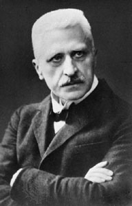
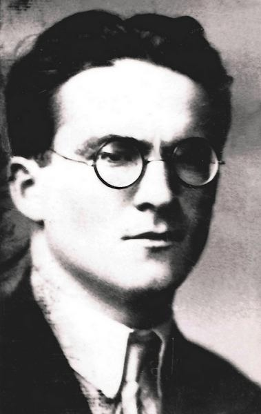
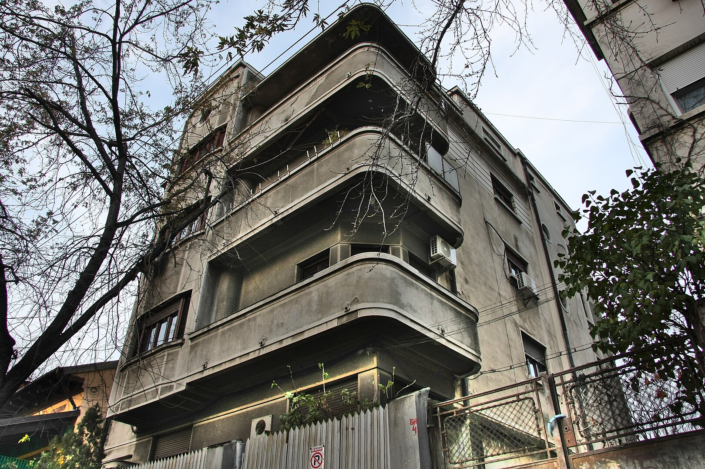
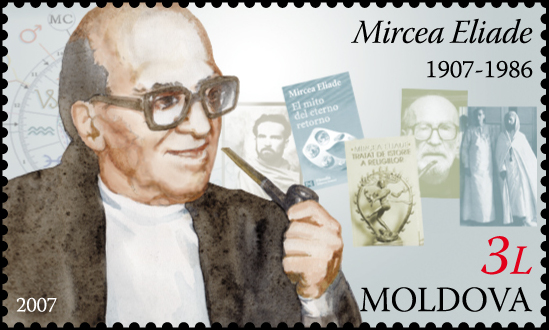
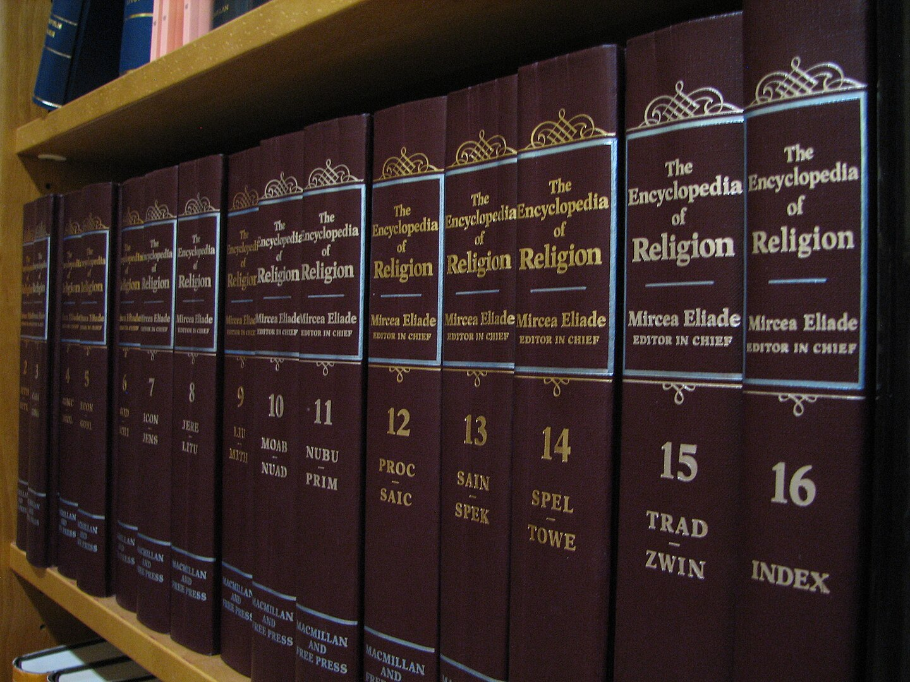
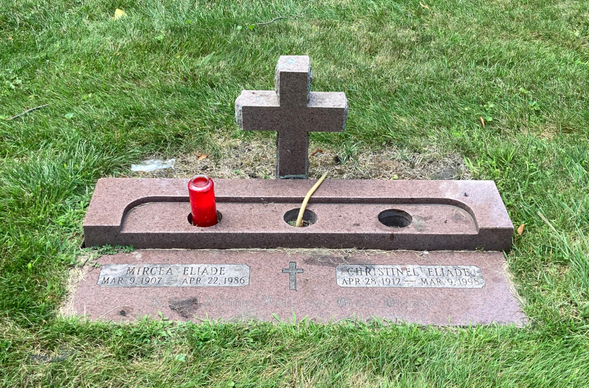

# Geschichte, Theorien und Methoden der Religionswissenschaft

### Wie Religion zum Forschungsgegenstand wurde
{: .r-fit-text}
  
#### 6.-7. Paradigmen (Phänomenologie): Rudolf Otto & Mircea Eliade
#### Was ist das Heilige?

Wintersemester 2024/2025
Prof. Dr. Nathan Gibson

## Einleitung

"Stille Nacht": Warum wird diese Nacht als "heilig" bezeichnet?

## Einleitung

<https://ars.particify.de/p/93793924/series/7-Mircea-Eliade>

<iframe src="https://ars.particify.de/p/93793924/series/7-Mircea-Eliade" width="100%" height="100%"></iframe>

## 📈 Rückblick: Letztes Lernziel

Die Erfindung des Begriffs "Weltreligionen" mit seinen Konnotationen im europäischen Diskurs skizzieren können.

## 📈 Rückblick: Pluralismus

Was ist mit dem Wort "Pluralismus" gemeint?
- Diverse Religionen existieren _nebeneinander_ in einer Gesellschaft _oder_
- Alle Religionen sind _gleichberechtigt_ bzw. gleichgestellt _oder_ 
- Alle Religionen haben die gleiche Gültigkeit. 

## 📈 Rückblick: Tomoko Masuzawa

Stellt vor, dass die Rede von Pluralismus in der ersten Hälfte der 20. Jhdt. eine neue Form der europäischen Hegemonie sei. (Masuzawa 2005, ix)

## 📈 Rückblick: Europäische Anordnungen von Religionen bis 19. Jhdt.

- Christentum vs. andere monotheistische
- monotheistisch vs. andere

(S. Masuzawa 2005, xi)

## 📈 Rückblick: Religiöse Globalisierung und das "Parliament of World Religions"

- Zuerst: Faszination für die Ursprünge von "primitiven Religionen", Fortschrittsannahme
- Dann: Anerkennung von mehr Diversität
- Das Parliament
  - Hintergrund & Ziele
  - Ereignisse
  - Effekte

## 📈 Rückblick: Europäische Identität nach der neuen Anordnung

- Merkmale von semitischen bzw. indoeuropäischen Sprachen verallgemeinert als kulturelle und religiöse Eigenschaften
- Christentum = europäisch, Islam & Judentum = semitisch

## 📈 Rückblick: Weltreligionen

"Weltreligionen" als Paradigma: mögliche Fallen
- subsuming, demoting local religions
- essentializing
- universalizing
- text-centering

## Gliederung

1. Rudolf Otto
   1. Leben und Einfluss
   2. Sammlung
   3. Begriffe
2. Mircea Eliade
   1. Leben und Einfluss
   2. Differenzierung zwischen dem Heiligen und dem Profanen
3. Phänomenologie

## Heutiges Lernziel

Phänomenologische Ansätze am Beispiel von Eliades und Ottos Konzeptionen des „Heiligen“ erkennen und anwenden.

## 1. Rudolf Otto: Leben & Einfluss

<https://www.deutschlandfunk.de/theologe-rudolf-otto-das-heilige-geheimnis-100.html>

<video width='450' controls>
    <source src='https://download.deutschlandfunk.de/file/dradio/2019/09/25/das_heilige_geheimnis_rudolf_otto_und_die_dlf_20190925_2010_33d376b2.mp3' type='video/mp4'>
</video>

## 1. Rudolf Otto: Leben & Einfluss

<figcaption>
    Image: Contemporary photograph - http://student.britannica.com/comptons/art-13317/Rudolf-Otto-1925, Public Domain, https://commons.wikimedia.org/w/index.php?curid=4249429
</figcaption>

## 1. Rudolf Otto: Leben & Einfluss

_Das Heilige. Über das Irrationale in der Idee des Göttlichen und sein Verhältnis zum Rationalen_

## 1. Rudolf Otto: Leben & Einfluss

- Mysterium tremendum: "Das göttliche Geheimnis, das den Menschen ehrfürchtig erschauern lässt"
- Mysterium fascinosum: "Das göttliche Geheimnis, das Entzücken hervorruft"
- das Numinose: "das Göttliche als unbegreifliches schauriges Geheimnis: als eine Vertrautheit, dass es einem kalt den Rücken herunterläuft"

Quelle: https://www.deutschlandfunk.de/theologe-rudolf-otto-das-heilige-geheimnis-100.html

## 1. Rudolf Otto: Leben & Einfluss

> Wir fordern auf, sich auf einen Moment starker und möglichst einseitiger religiöser Erregtheit zu besinnen. Wer das nicht kann oder wer solche Momente überhaupt nicht hat, ist gebeten, nicht weiter zu lesen. Denn wer sich zwar auf seine Pubertätsgefühle, Verdauungsstockungen oder auch Sozialgefühle besinnen kann, auf eigentümlich religiöse Gefühle aber nicht, mit dem ist schwierig, Religionskunde zu treiben. (Otto 1926, 8)

## 1. Rudolf Otto: Sammlung

<https://www.uni-marburg.de/de/relsamm/sammlung/dauerausstellung>

## 1. Rudolf Otto: Begriffe & Lektüre

Handout: Was ist hier ...
- Mysterium tremendum?
- Mysterium fascinosum?
- das Numinose?

## 2. Mircea Eliade: Leben

- geboren 1907, Bukarest
- erstes Roman mit 14
- Epiphanie als Kind
  > I practiced for many years [the] exercise of recapturing that epiphanic moment, and I would always find again the same plenitude. I would slip into it as into a fragment of time devoid of duration—without beginning, middle, or end. (Eliade, Autobiography, in Ellwood, pp. 98–99)

## 2. Mircea Eliade: Leben

- Studium (Philosophie) in Bukarest
- ab ca. 1928 Studienaufenthalt in Indien
- 1933 Promovierte zu Yoga-Praktiken

## 2. Mircea Eliade: Leben

> Als ich nach drei Jahren aus Indien zurückkam, verstand ich die Bedeutung unserer Volkstraditionen in Südosteuropa. Die ländlichen Kulturen und die traditionelle Folklore waren bei uns noch lebendig. Im Westen waren sie zwar nicht tot, aber ein wenig eingeschlafen. (Interview mit Paul Barbă Neagră für das Dokumentationsfilm „Mircea Eliade und die Wiederentdeckung des Heiligen“. 
https://www.deutschlandfunk.de/religionsphilosoph-mircea-eliade-heilung-durch-das-heilige-100.html)

## 2. Mircea Eliade: Leben

- unterstützte den Eisernen Gard (antisemitisch, faschistisch)
- eigene Reaktionen zu Antisemitismus etwas ambivalent (s. Manea, "Happy Guilt," 1991)
 

## 2. Mircea Eliade: Leben

- 1956 University of Chicago, History of Religions

## 2. Mircea Eliade: Leben

[UChicago Papers Box 171](https://www.lib.uchicago.edu/e/scrc/findingaids/view.php?eadid=ICU.SPCL.ELIADEM#idp45021512)

- Tobacco pipe, undated
- 5 pencil sharpeners, undated
- Shoe horn, undated
- 4 keys, undated
- Pocketknife, undated
- Metal and glass (or amber) pill box, undated
- Embossed leather notebook, blank, undated
- Fabric notebook, undated
- Mechanical pencil, undated

## 2. Mircea Eliade: Leben

 

## 2. Mircea Eliade: Leben

- 1986 in Chicago gestorben

## "Das Heilige und das Profane"

- das "Heilige" nach Otto, plus noch mehr
- Hierophanie - etwas Heiliges sich uns zeigt
- homo religiosus

## Heiliger Raum

Welche Orte sind an unseren Uni "heilig"?

## 3. Phänomenologie

<!-- 
Can it be wissenschaftlich begründet? Induktiv? Komparativ?
 -->

## Feedback

<https://ars.particify.de/p/93793924/series/7-Feedback>

<iframe src="https://ars.particify.de/p/93793924/series/7-Feedback" width="100%" height="100%"></iframe>

## Vorschau

### Paradigmen (Strukturfunktionalismus): Mary Douglas	

Welche Rolle spielen Reinheit und Gefährdung?