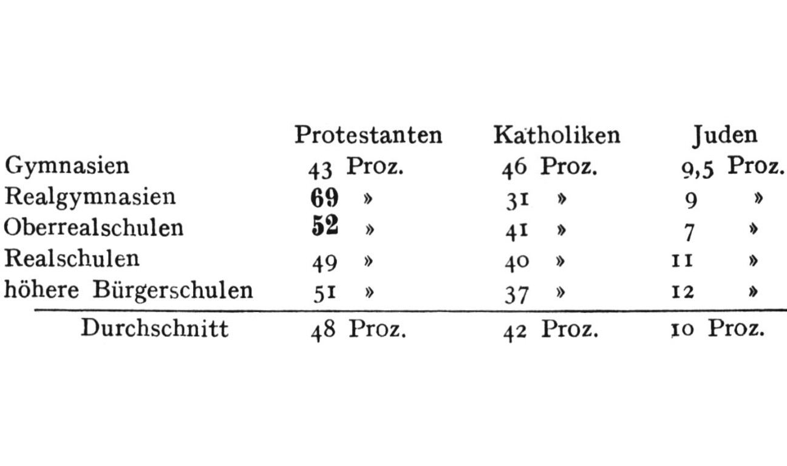

# Einführung in die Religionswissenschaft

### Aktuelle Themen in der Religionsforschung
{: .r-fit-text}

### 10. Paradigmen (Ethnographie): Clifford Geertz / 11. Entzauberung: Max Weber

Wintersemester 2024/2025
Prof. Dr. Nathan Gibson

## Einleitung

## 📈 Rückblick

Jeopardy <https://jeopardylabs.com/play/geschichte-theorien-und-methoden-der-religionswissenschaft>

## 📈 Rückblick: Lernziel

Schildern wie Victor und Edith Turner durch ethnografische Feldforschung zu Ritualen als Symbolsysteme und insbesondere zum Konzept der Liminalität gelangten.

## 📈 Rückblick: Victor (1920-1983) & Edith Turner (1921-2016)

- 1951-1954 Feldforschung in Sambia
- 1963 V. Turner Professor an der Cornell Universität
- ab 1968 V. Turner in Chicago
- ab 1984 E. Turner an der University of Virginia

## 📈 Rückblick: Arbeitsmethoden

> In den Sozialwissenschaften erkennt man, wie ich meine, heute zunehmend, daß **religiöse Vorstellungen und Praktiken mehr als "groteske" Widerspiegelungen** oder Ausdrucksformen **wirtschaftlicher, politischer und sozialer Beziehungen** sind; man sieht in ihnen nun immer häufiger den entscheidenden Zugang zum Verständnis dessen, **was Menschen über diese** Beziehungen und die natürlichen wie sozialen Umwelten, in denen sie funktionieren, **denken und was sie dabei empfinden**. (V. Turner 2005, 13)

## 📈 Rückblick: Arbeitsmethoden

_Das Ritual_, 14-17: wollte die Sozialorganisation verstehen, lernte aber, dass Ritual ein Schlüssel dafür ist

## 📈 Rückblick: Ritual & Liminalität

– Übergangsriten haben 3 Phasen:
  - separation
  - margin (= Liminalität)
  - aggregation
- Liminalität mit Nichtexistenz bzw. Tod oder Unreinheit assoziiert

s. V. Turner (1987)

## 📈 Rückblick: Ritual & Liminalität

- Durch Übergangsriten lernen Neophyten die Struktur ihrer Kultur
- z.B. Gleichberechtigung und Kameradschaft mit anderen Neophyten

## 📈 Rückblick: Ritual & Liminalität

> invitation to investigators of ritual to focus their attention on the phenomena and processes of mid-transition. It is these, I hold, that paradoxically expose the basic building blocks of culture just when we pass out of and before we re-enter the structural realm. (347)

## Heutige Lernziele

1. "Thick Description" als ein ethnographischer Ansatz erfassen.
2. Religionssoziologische Fragestellungen an Beispielen aus dem Werk Max Webers erläutern.

## 1. Clifford Geertz

## Intro

Welche _Funktionen_ hat diese Vorlesung?
{: .fragment} 

Welche _Bedeutungen_ hat diese Vorlesung?
{: .fragment}

## Gliederung

- Clifford Geertz (1926-2006): Leben & Karriere
- Teilnehmende Beobachtung und Thick Description
- Religion, thickly described

## Leben 

<iframe width="100%" height ="100%" src="https://www.youtube.com/embed/3dQDx3axrDs?si=i6qsI_yoNzJtC4dL&amp;start=36" title="YouTube video player" frameborder="0" allow="accelerometer; autoplay; clipboard-write; encrypted-media; gyroscope; picture-in-picture; web-share" referrerpolicy="strict-origin-when-cross-origin" allowfullscreen></iframe>

## Leben

- 1956 Promotion (Harvard University)
- 1960 University of Chicago
- 1960–1963 Bücher über Feldforschung in Indonesien
- 1968 _Islam Observed_ (Indonesien und Marokko)
- 1970 Institute for Advanced Study Princeton
- 1973 _The Interpretation of Cultures_ 

## Teilnehmende Beobachtung und Thick Description

## Teilnehmende Beobachtung: Hintergrund

- Popularisiert von Bronisław Malinowski (1884-1942)
- Vorarbeit u.a. von Bateson und Mead
- Geertz: Situation in Bali

## Was sind die Ergebnisse von teilnehmender Beobachtung?

Analyse? Beschreibung? Auf welche Art und Weise?

## Thick Description (Dichte Beschreibung)

> (1973, 5) Believing, with Max Weber, that man is an animal suspended in webs of significance he himself has spun, I take culture to be those webs, and the analysis of it to be therefore not an experimental science in search of law but an interpretive one in search of meaning.

## Thick Description (Dichte Beschreibung)

> (1973, 9–10) Analysis, then, is sorting out the structures of signification ... Doing ethnography is like trying to read (in the sense of "construct a reading of') a manuscript-foreign, faded, full of ellipses, incoherencies, suspicious emendations, and tendentious commentaries ...

## Thick Description (Dichte Beschreibung)

> (1973, 10) Culture, this acted document, thus is public ... Though ideational, it does not exist in someone's head; though unphysical, it is not an occult entity.

## Thick Description (Dichte Beschreibung)

"Thin" vs. "thick" description (nach Gilbert Ryle): The difference between a "twitch" and a "wink"

## Thick Description Beispiel: Hahnenkampf

[Geertz, Clifford. »Deep Play«: Bemerkungen zum balinesischen Hahnenkampf. In Dichte Beschreibung. Beiträge zum Verstehen kultureller Systeme, translated by Brigitte Luchesi, 202–60. Suhrkamp-Taschenbuch Wissenschaft. Frankfurt am Main: Suhrkamp, 2003.](https://olat-ce.server.uni-frankfurt.de/olat/auth/RepositoryEntry/21098758150/CourseNode/93668888136198/10-Geertz+-+2003+-+%C2%BBDeep+Play%C2%AB+Bemerkungen+zum+balinesischen+Hahnenk.pdf)

## Was gehört zu Thick Description

1. Accurately describes and interprets within context
2. Captures thoughts, emotions, and webs of social interaction
3. Assigns motivations and intentions
4. Reader experiences sense of verisimilitude as they read (they feel they are there)
5. Leads to thick interpretation and thick meaning (of findings)

nach Ponteretto (2006), zusammengefasst von [Leslie Reich, "Thick Description"](https://www.youtube.com/watch?v=eMZbZbQNZe4&list=PLnGravZsYAxogmD1HSKlDvZ8CGRby6ih0&index=8)
 
## Religion, thickly described

> (1966, 4) [Religion is] [1] a system of symbols which acts to [2] establish powerful, pervasive, and long-lasting moods and motivations in men by [3] formulating conceptions of a general order of existence and [4] clothing these conceptions with such an aura of factuality that [5] the moods and motivations seem uniquely realistic.

## Emojis - dichte Beschreibung



## 2. Max Weber (1864-1920)

### Leben

<video width='450' controls>
    <source src='https://archive.org/download/maxweber-dieentzauberungderwelt/Max%20Weber.mp4' type='video/mp4'>
</video>

(bis 6:25)

## Leben

- Jura-Studium in Heidelberg
- 1889 Promotion
- ab 1888 Verein für Socialpolitik, Studie über Ostflucht
- 1904/1905 *Protestantische Ethik*, überarbeitet in 1920

## Soziologie: Definition

> eine Wissenschaft, welche soziales Handeln deutend verstehen und dadurch in seinem Ablauf und seinen Wirkungen ursächlich erklären will (Weber, „Wirtschaft und Gesellschaft", 1920)

## Entzauberung und die protestantische Ethik

## Entzauberung und die protestantische Ethik

<video width='450' controls>
    <source src='https://archive.org/download/maxweber-dieentzauberungderwelt/Max%20Weber.mp4#t=00:15:30' type='video/mp4'>
</video>

(ab 15:30)

## Rationalisierung

<video width='450' controls>
    <source src='https://archive.org/download/maxweber-dieentzauberungderwelt/Max%20Weber.mp4#t=00:18:50' type='video/mp4'>
</video>

(ab 18:50)

## Herrschaftstypen

s. Handout

## Vorschau

Entzauberung: Pierre Bourdieu

