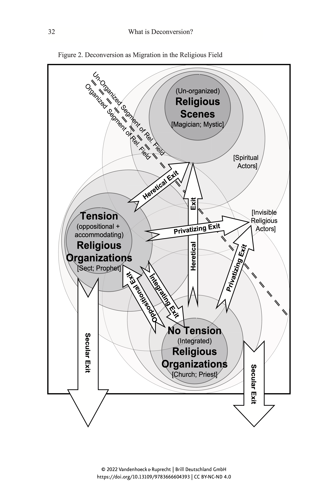
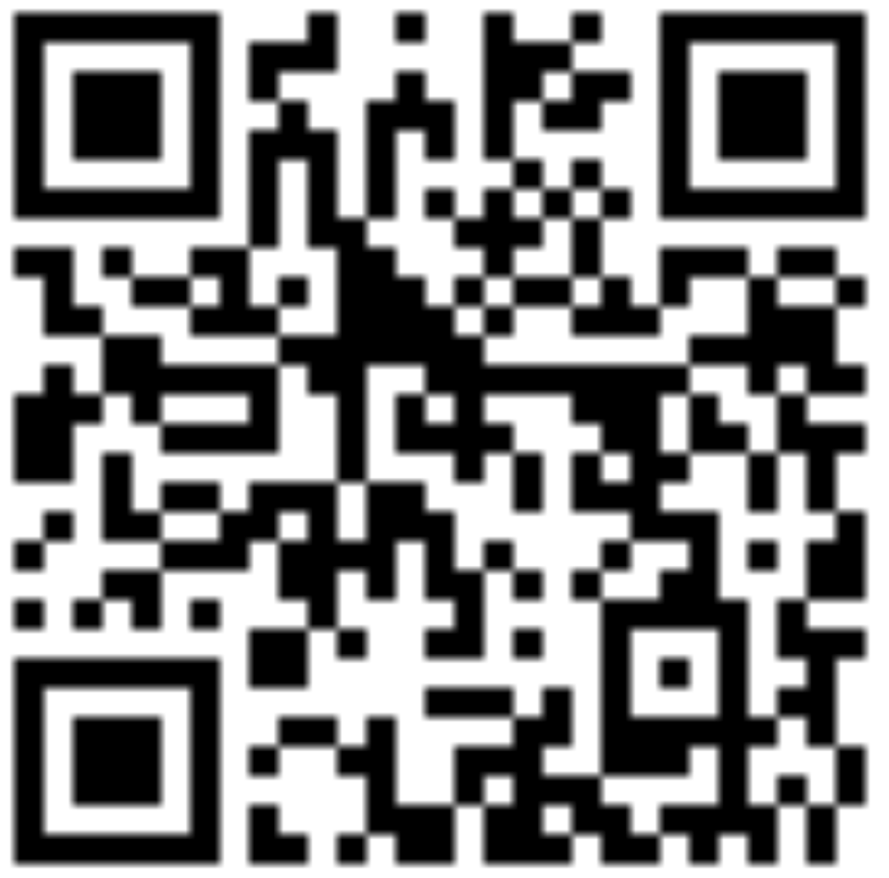

# Einführung in die Religionswissenschaft

### Aktuelle Themen in der Religionsforschung
{: .r-fit-text}

### 12. Entzauberung: Pierre Bourdieu: Wie wird auf dem religiösen Marktplatz gehandelt?

Wintersemester 2024/2025
Prof. Dr. Nathan Gibson

## Einleitung

## 📈 Rückblick: Lernziel

"Thick Description" als ein ethnographischer Ansatz erfassen.

## 📈 Review: Clifford Geertz (1926–2006)

- Ethnologe (ab 1960 an der University of Chicago, ab 1970 Institute for Advanced Study Princeton)
- Feldforschungen in Indonesien und Marokko
- Für den Ansatz "Thick Description" bekannt
- Werke (u.a.):
  - 1968 _Islam Observed_ 
  - 1973 _The Interpretation of Cultures_ 

## 📈 Review: Kultur

Nach Geertz, die Kultur ist interpretationsbedürftig, aber öffentlich.

## 📈 Review: Thick Description

Thick Description (Dichte Beschreibung) stellt die Ergebnisse der **teilnehmenden Beobachtung** dar und versucht, die **kulturelle Bedeutung** des beobachteten Phänomens tiefgehend zu interpretieren.

## 📈 Review: Thick Description

> (1973, 5) Believing, with Max Weber, that man is an animal suspended in webs of significance he himself has spun, I take culture to be those webs, and the analysis of it to be therefore not an experimental science in search of law but an interpretive one in search of meaning.

## 📈 Review: Was gehört zu Thick Description?

1. Accurately describes and interprets within context
2. Captures thoughts, emotions, and webs of social interaction
3. Assigns motivations and intentions
4. Reader experiences sense of verisimilitude as they read (they feel they are there)
5. Leads to thick interpretation and thick meaning (of findings)

nach Ponteretto (2006), zusammengefasst von [Leslie Reich, "Thick Description"](https://www.youtube.com/watch?v=eMZbZbQNZe4&list=PLnGravZsYAxogmD1HSKlDvZ8CGRby6ih0&index=8)
 
## 📈 Review: Religion, thickly described

> (1966, 4) [Religion is] [1] a system of symbols which acts to [2] establish powerful, pervasive, and long-lasting moods and motivations in men by [3] formulating conceptions of a general order of existence and [4] clothing these conceptions with such an aura of factuality that [5] the moods and motivations seem uniquely realistic.

## 📈 Review: Emojis - dichte Beschreibung



## Heutiges Lernziel

1. Religionssoziologische Fragestellungen an Beispielen aus dem Werk Max Webers erläutern.
2. Bourdieus Begriffe "Habitus" und "religiöses Feld" als machtkritische Paradigmen erläutern.

## 1. Max Weber (1864-1920)

### Leben

- Jura-Studium in Heidelberg
- 1889 Promotion
- ab 1888 Verein für Socialpolitik, Studie über Ostflucht
- 1904/1905 *Protestantische Ethik*, überarbeitet in 1920

## Soziologie: Definition

> eine Wissenschaft, welche soziales Handeln deutend verstehen und dadurch in seinem Ablauf und seinen Wirkungen ursächlich erklären will (Weber, „Wirtschaft und Gesellschaft", 1920)

## Entzauberung und die protestantische Ethik

## Entzauberung und die protestantische Ethik

<video width='450' controls>
    <source src='https://archive.org/download/maxweber-dieentzauberungderwelt/Max%20Weber.mp4#t=00:15:30' type='video/mp4'>
</video>

(15:30-17:14)

## Entzauberung und die protestantische Ethik

> Diese rationale Lebensweise löst sich von ihren religiösen Wurzeln und wird zum Selbstzweck. Die Religion ist nicht mehr nötig. Die Rationalisierung wird nun von den innerweltlichen Mächten vorangetrieben. Die religiöse Entzauberung der Welt ist an ihr Ende gekommen. Die rationale Lebensführung lebt fort. [(Kolb 2006)](http://archive.org/details/maxweber-dieentzauberungderwelt)

## Entzauberung und die protestantische Ethik

(Heinrich Böll, Anekdote zur Senkung der Arbeitsmoral, 1963)

<aside class='notes'>

From Wenzel powerpoint: In einem Hafen an der Westküste Europas schläft ein ärmlich gekleideter Fischer und wird durch das Klicken des Fotoapparates eines Touristen geweckt. 
Anschließend fragt der Tourist den Fischer, warum er denn nicht draußen auf dem Meer sei und fische. Heute sei doch so ein toller Tag, um einen guten Fang zu machen, es gebe draußen viele Fische. Da der Fischer keine Antwort gibt, denkt sich der Tourist, dem Fischer gehe es nicht gut, und fragt ihn nach dessen Befinden, doch der Fischer hat nichts zu beklagen. Der Tourist hakt noch einmal nach und fragt den Fischer abermals, warum er denn nicht hinausfahre. Nun antwortet der Fischer, er sei schon draußen gewesen und habe so gut gefangen, dass es ihm für die nächsten Tage noch reiche. Der Tourist entgegnet, dass der Fischer noch zwei-, drei- oder gar viermal hinausfahren und dann ein kleines Unternehmen aufbauen könnte, danach ein größeres Unternehmen und dieses Wachstum schließlich immer weiter steigern könnte, bis er sogar das Ausland mit seinem Fisch beliefern würde. Danach hätte der Fischer dann genug verdient, um einfach am Hafen sitzen und sich ruhig entspannen zu können. Der Fischer entgegnet gelassen, am Hafen sitzen und sich entspannen könne er doch jetzt schon. 
    
</aside>

## Rationalisierung

<video width='450' controls>
    <source src='https://archive.org/download/maxweber-dieentzauberungderwelt/Max%20Weber.mp4#t=00:18:50' type='video/mp4'>
</video>

Vergleich der Religionen, Begriff "innerweltliche Askese" (18:50-21:05)

## Entzauberung kurz gesagt

Der Protestantismus hat in einigen Gesellschaften dazu geführt, dass die Religion weder als Erklärung mystischer Geheimnisse noch als Heilsbringer gebraucht wird. Die Wissenschaft und die Wirtschaft sind zu Selbstläufern geworden.

## Herrschaftstypen

s. Handout

## 2. Pierre Bourdieu

## Gliederung

- Pierre Bourdieu (1930–2002): Leben & Karriere
- Funktionen der Religion
  - Feld
  - Kapital
  - Habitus

## 2.1. Leben & Karriere

<audio controls><source src='https://media.neuland.br.de/file/1810844/c/website/pierre-bourdieu-denker-der-feinen-unterschiede.mp3' type='audio/mp3'></audio>

<iframe data-src="/assets/pdf/radiowissen-pierre-bourdieu.pdf" data-preload width="100%" height="100%"></iframe>

## 2.1. Leben & Karriere

- Was hat das Leben von Bourdieu mit seinen Ideen zu tun?

## 2.2. Funktionen der Religion

- Marx: Klassenstruktur
- Durkheim: Korrespondenz zwischen sozialen und mentalen Strukturen

## 2.2. Funktionen der Religion

> (Durkheim 1912 [2007], 75) Eine Religion ist ein solidarisches System von Überzeugungen und Praktiken, die sich auf heilige, d. h. abgesonderte und verbotene Dinge, Überzeugungen und Praktiken beziehen, die in einer und derselben moralischen Gemeinschaft, die man Kirche nennt, alle vereinen, die ihr angehören.

## 2.2. Funktionen der Religion

- Marx: Klassenstruktur
- Durkheim: Korrespondenz zwischen sozialen und mentalen Strukturen
- Weber: Produktion von symbolischen Gütern

## 2.2. Funktionen der Religion: Feld

> (1987 [1971], 121): the set of all the possible objective relations between positions

## 2.2. Funktionen der Religion: Feld

{: .r-stretch}

## 2.2. Funktionen der Religion: Kapital

> (2000, 77): Das religiöse Kapital, über das die unterschiedlichen religiösen Instanzen, Akteure oder Institutionen, im Konkurrenzkampf um das Monopol über die Verwaltung der Heilsgüter und der legitimen Ausübung der religiösen Macht verfügen, ist entscheidend für die Natur, die Form und die Durchsetzungskraft der Strategien, welche diese Instanzen in den Dienst der Befriedigung ihrer religiösen Interessen stellen können, sowie für die Funktionen, die sie innerhalb der Teilung der religiösen Arbeit übernehmen.

## 2.2. Funktionen der Religion: Habitus

> (1977 [1972], 78): “matrix of perceptions” or “the basis of perception and appreciation of all subsequent experiences”

## 2.2. Funktionen der Religion: Zusammengefasst 

{: .r-stretch}

(Swartz 2010, 78)

## 2.2. Funktionen der Religion: Zusammengefasst 

Die Religion hat die Funktion, ein System von Praktiken und Vorstellungen zu entwickeln, das sich auf das Prinzip einer natürlich-übernatürlichen Struktur des Kosmos gründet und damit die objektiv bestehenden irdischen Verhältnisse wiederholt und einprägt. Damit trägt sie zur (verschleierten) Durchsetzung der Wahrnehmungs- und Denkmuster bei...

## 2.2. Funktionen der Religion: Zusammengefasst 
Zur Wirkung der Legitimation kommt es allerdings nicht nur durch die Herstellung einer Entsprechung zwischen der kosmologischen Hierarchie und der sozialen und kirchlichen Hierarchie, sondern auch und vor allem durch die Auferlegung einer hierarchischen Denkweise, welche die Ordnungsbeziehungen dadurch natürlich erscheinen lässt, dass sie die Existenz privilegierter Punkte im kosmischen wie im politischen Raum setzt und/oder anerkennt. (Wenzel nach Bourdieu 2000, 97–98) 

## Agree or disagree?

> (1990b, 196): ‘God is never anything other than society. What is expected of God is only ever obtained from society, which alone has the power to justify you, to liberate you from facticity, contingency, and absurdity’

## Lehrevaluation

<http://r.sd.uni-frankfurt.de/55015bc8>

{: height="500px"}

## Vorschau

Entzauberung: Jacques Derrida: Wie wird Religion dekonstruiert?
