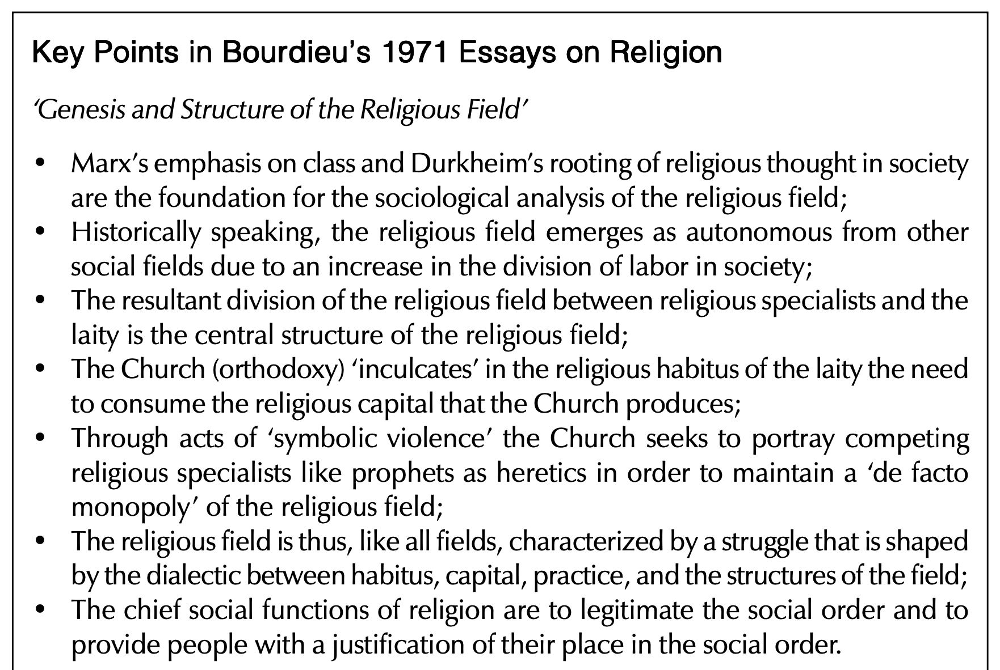

# Einführung in die Religionswissenschaft

### Aktuelle Themen in der Religionsforschung
{: .r-fit-text}

### 13. Jacques Derrida: Wie wird Religion dekonstruiert?

Wintersemester 2024/2025
Prof. Dr. Nathan Gibson

## 📈 Rückblick: Lernziele

1. Religionssoziologische Fragestellungen an Beispielen aus dem Werk Max Webers erläutern.
2. Bourdieus Begriffe "Habitus" und "religiöses Feld" als machtkritische Paradigmen erläutern.

## 📈 Rückblick: Max Weber (1864-1920)

- 1904/1905 *Protestantische Ethik*, überarbeitet in 1920
- Definition von der Soziologie: 
    > eine Wissenschaft, welche soziales Handeln deutend verstehen und dadurch in seinem Ablauf und seinen Wirkungen ursächlich erklären will (Weber, „Wirtschaft und Gesellschaft", 1920)

## 📈 Rückblick: Entzauberung und die protestantische Ethik

- Begriff: "innerweltliche Askese"
- Entzauberung kurz gesagt: Der Protestantismus hat in einigen Gesellschaften dazu geführt, dass die Religion weder als Erklärung mystischer Geheimnisse noch als Heilsbringer gebraucht wird. Die Wissenschaft und die Wirtschaft sind zu Selbstläufern geworden.

## 📈 Rückblick: Herrschaftstypen

1. rationalen Charakters: durch Recht/Gesetz legitimiert
2. traditionalen Charakters: durch Tradition legitimiert
3. charismatischen Charakters: durch Heiligkeit/Vorbildlichkeit legitimiert

## 📈 Rückblick: Pierre Bourdieu (1930–2002)

- Das religiöse "Feld" als ein Marktplatz, wo es um "Kapital" geht. Religiöse Autoritäten ringen um Kund/innen.

## Funktionen der Religion: Habitus

> das Auftreten oder die Umgangsformen einer Person, die Gesamtheit ihrer Vorlieben und Gewohnheiten oder die Art ihres Sozialverhaltens (https://de.wikipedia.org/wiki/Habitus_(Soziologie), 2025-02-06)

## Funktionen der Religion: Zusammengefasst 

{: .r-stretch}

(Swartz 2010, 78)

## Funktionen der Religion: Zusammengefasst 

Die Religion hat die Funktion, ein System von Praktiken und Vorstellungen zu entwickeln, das sich auf das Prinzip einer natürlich-übernatürlichen Struktur des Kosmos gründet und damit die objektiv bestehenden irdischen Verhältnisse wiederholt und einprägt. Damit trägt sie zur (verschleierten) Durchsetzung der Wahrnehmungs- und Denkmuster bei...

## Funktionen der Religion: Zusammengefasst 
Zur Wirkung der Legitimation kommt es allerdings nicht nur durch die Herstellung einer Entsprechung zwischen der kosmologischen Hierarchie und der sozialen und kirchlichen Hierarchie, sondern auch und vor allem durch die Auferlegung einer hierarchischen Denkweise, welche die Ordnungsbeziehungen dadurch natürlich erscheinen lässt, dass sie die Existenz privilegierter Punkte im kosmischen wie im politischen Raum setzt und/oder anerkennt. (Wenzel nach Bourdieu 2000, 97–98) 

## Agree or disagree?

> (1990b, 196): ‘God is never anything other than society. What is expected of God is only ever obtained from society, which alone has the power to justify you, to liberate you from facticity, contingency, and absurdity’

## Heutiges Lernziel

Die Relevanz der "Dekonstruktion", des Diskursbegriffs und der "Hermeneutik des Verdachts" für religionskritische Ansätze erläutern.

## Relevante Begriffe für kritische Ansätze zur Religion

| Dekonstruktion (Derrida) | Diskurs (Foucault) | Hermeneutik des Verdachts (Ricoeur) |
| -- | -- | -- |
| Bedeutung (Worte, Identität) als instabil | Rede als Macht | Text als Zugang zu unbewussten Machtideologien |

## Forschungsobjekte in der Religionswissenschaft

## Hermeneutik (Interpretation bzw. Auslegung)

